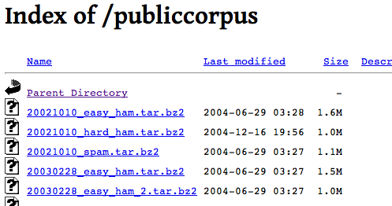

---fill
<h1 style='color:white;text-shadow: 1px 1px 7px #555555; filter: dropshadow(color=#7a7a7a, offx=2, offy=2);'>SPAM</h1>

---fill


--- 
## Un ejemplo sencillo (Thrun, 2011)
 
### SPAM
* Offer is secret      
* Click secret link    
* Secret sports link   
 
### HAM
* Went play sports
* Secret sports event
* Sport is today
* Play sport today
* Sport costs money

---
## Quiz

### ¿Cuál es tamaño del vocabulario?

### ¿Cuál es la probabilidad de ser SPAM?

### Calcular:
\[ \mathbf{P}(\mbox{ "secret" }\,|\,\mbox{ SPAM })\]
\[ \mathbf{P}(\mbox{ "secret" }\,|\,\mbox{ HAM })\]
### Una difícil:
\[ \mathbf{P}(\mbox{ SPAM }\,|\,\mbox{ "sports" })\]

---
## Teorema de Bayes = Aprendizaje

\[
  \hat{\mathbf{P}}(A)=\mathbf{P}(A\,|\,B)=\frac{\mathbf{P}(B\,|\,A)\mathbf{P}(A)}{\mathbf{P}(B)}
\]

Corazonada previa: $\mathbf{P}(A)$

Lo que vimos es cierto basado en nuestra suposición: $\mathbf{P}(B\,|\,A)$

### Al final aprendimos de la experiencia

---
## Hay que hacerlo en grande

### Nuestro músculo será la computadora 
En internet hay _corpus_ de entrenamiento. <br />
Usaremos el de Spamassassin de Apache [http://goo.gl/WUz30](http://goo.gl/WUz30)
<br/>
<br/>


--- build
## R como herramienta de análisis

- Es un software creado para hacer análisis estadístico
- Es libre y tiene una comunidad muy activa http://www.r-bloggers.com/
- Hay lbrerías para casi cualquier problema y se pueden crear nuevas muy fácilmente
- Hoy usaremos: `ggplot2` = gráficas y `tm` = minería de textos

### Para descargar el código y el _corpus_ de SPAM  ir a 
### http://goo.gl/RZj6Y

---
## Empezamos

``` {r instala_librerias, eval=FALSE}
install.packages(c('ggplot2', 'tm'))
library(ggplot2)
library(tm)
```
Nuestra primera función: LeerCorpus
``` {r eval=FALSE}
LeerCorpus <- function(folder){
  texto <- scan(folder, character(), sep='\n', quiet=TRUE,
               blank.lines.skip = FALSE, encoding='LATIN1')
  # El mensaje empieza cuando hay una linea vacia
  msg <- texto[seq(which(texto == "")[1] + 1, length(texto), 1)]
  return(paste(msg, collapse='\n'))
}
```

---
## Continuamos...
Ahora usaremos la función para leer todos los mensajes SPAM
```{r eval=FALSE}
getwd('')
spam.folder <- 'data/spam/' # o el folder donde lo guardaste
spam.docs <- dir(spam.folder)
spam.docs <- spam.docs[which(spam.docs!='cmds')]
todo.spam <- sapply(spam.docs, 
                    function(f) LeerCorpus(paste(spam.folder, f, sep='') ))
```

---
## Calcular probabilidades
Calcularemos la matriz de términos-documentos http://goo.gl/3i5Tj
``` {r tdm, eval=FALSE}
Calcula.TDM <- function(vec.doc){
  # Construye el corpus de los textos
  doc.corpus <- Corpus(VectorSource(vec.doc))
  # Limpiar lectura
  doc.corpus <- tm_map(doc.corpus, stripWhitespace)
  doc.corpus <- tm_map(doc.corpus, removeNumbers)
  doc.corpus <- tm_map(doc.corpus, tolower)
  doc.corpus <- tm_map(doc.corpus, removeWords, stopwords())
  doc.corpus <- tm_map(doc.corpus, removePunctuation)
  # TDM
  doc.tdm <- TermDocumentMatrix(doc.corpus, 
                                control=list(minDocFreq = 2))
  return(doc.tdm)
}
```

---
## Continua...
``` {r eval=FALSE}
spam.tdm <- Calcula.TDM(todo.spam)
spam.matriz <- as.matrix(spam.tdm)
spam.contar <- rowSums(spam.matriz)
spam.df <- data.frame(termino=names(spam.contar), frecuencia=as.numeric(spam.contar), stringsAsFactors=FALSE)
spam.ocurrencia <- sapply(1:nrow(spam.matriz), function (i) {length(which(spam.matriz[i, ]>0))/ncol(spam.matriz)}) 
spam.densidad <- spam.df$frecuencia/sum(spam.df$frecuencia)
spam.df <- transform(spam.df, densidad=spam.densidad, ocurrencia=spam.ocurrencia)
```

---
## Lo mismo para el HAM
``` {r eval=FALSE}
ham.docs <- dir(ham.folder)
ham.docs <- ham.docs[which(ham.docs!='cmds')]
todo.ham <- sapply(ham.docs, 
                   function(f) LeerCorpus(paste(ham.folder, f, sep='')))
ham.tdm <- Calcula.TDM(todo.ham)
ham.matriz <- as.matrix(ham.tdm)
ham.contar <- rowSums(ham.matriz)
...
```

---
## Un vistazo a los _data frames_
```{r }
head(spam.df[with(spam.df, order(-ocurrencia)), ])
head(ham.df[with(ham.df, order(-ocurrencia)), ])
```

---
## \<Math\> Break!
Hay dos problemas
- ¿Cuánto del correo es SPAM? o no: creencia previa.
- Si hay algo que nunca hemos visto no lo sabemos clasificar: corrección de la muestra.

---
## La clasificación
```{r eval=FALSE}
Clasifica.email <- function(folder, training.df, prior = 0.5, c = 1e-6)
{
  # Leer los correos para ponerlos en formato trabajable
  msg <- LeerCorpus(folder)
  msg.tdm <- Calcula.TDM(msg)
  msg.freq <- rowSums(as.matrix(msg.tdm))
  # Encontrar la inteseccion de terminos
  msg.match <- intersect(names(msg.freq), training.df$termino)
  # Calculo de Bayes
  if(length(msg.match) < 1)
  {
    return(prior * c ^ (length(msg.freq)))
  }
  else
  {
    match.probs <- training.df$ocurrencia[match(msg.match, training.df$termino)]
    return(prior * prod(match.probs) * c ^ (length(msg.freq) - length(msg.match)))
  }
}
```
---
## La clasificación... correción log
```{r Clasificacemail, eval=FALSE}
Clasifica.email <- function(folder, training.df, prior = 0.5, c = 1e-6)
{
  # Leer los correos para ponerlos en formato trabajable
  msg <- LeerCorpus(folder)
  msg.tdm <- Calcula.TDM(msg)
  msg.frec <- rowSums(as.matrix(msg.tdm))
  # Encontrar la inteseccion de terminos
  msg.match <- intersect(names(msg.frec), training.df$termino)
  # Calculo de Bayes
  if(length(msg.match) < 1)
  {
    return(log(prior) + (length(msg.frec))*log(c))
  }
  else
  {
    match.probs <- training.df$ocurrencia[match(msg.match, training.df$termino)]
    return(log(prior) + sum(log(match.probs)) + 
      (length(msg.frec) - length(msg.match))*log(c))
  }
}
```

---
## Identificando el Hard HAM
```{r eval=FALSE}
hardham.docs <- dir(hardham.folder)
hardham.docs <- hardham.docs[which(hardham.docs != "cmds")]
hardham.spamtest <- sapply(hardham.docs,
                           function(p) Clasifica.email(paste(hardham.folder, p, sep=''), training.df = spam.df))

hardham.hamtest <- sapply(hardham.docs,
                          function(p) Clasifica.email(paste(hardham.folder, p, sep=''), training.df = ham.df))

hardham.res <- ifelse(hardham.spamtest > hardham.hamtest,
                      TRUE,
                      FALSE)
```

--- 
## Resultado
```{r}
summary(hardham.res)
```
### :-( ... resultado pobre
### PERO ES ESCALABLE

---
## Seguir la historia
- The Theory That Would Not Die - Historia http://goo.gl/Gr4Se
- Machine Learning for Hackers - Ejercios en R http://goo.gl/d1uIS
- Artificial Intelligence - Teoría http://goo.gl/vs2v5
- Blogs: http://goo.gl/mmO9k
- Gente que seguir: [@statpumpkin](https://twitter.com/statpumpkin) [@hmanson](https://twitter.com/hmason)
- _Datasets_ para jugar http://bit.ly/H9o9fn

