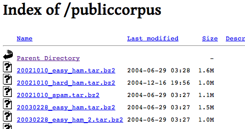

---fill
<h1 style='color:white;text-shadow: 1px 1px 7px #555555; filter: dropshadow(color=#7a7a7a, offx=2, offy=2);'>SPAM</h1>

---fill

--- 
## Un ejemplo sencillo (Thrun, 2011)
 
### SPAM
* Offer is secret      
* Click secret link    
* Secret sports link   
 
### HAM
* Went play sports
* Secret sports event
* Sport is today
* Play sport today
* Sport costs money

---
## Quiz

### ¿Cuál es tamaño del vocabulario?

### ¿Cuál es la probabilidad de ser SPAM?

### Calcular:
\[ \mathbf{P}(\mbox{ "secret" }\,|\,\mbox{ SPAM })\]
\[ \mathbf{P}(\mbox{ "secret" }\,|\,\mbox{ HAM })\]
### Una difícil:
\[ \mathbf{P}(\mbox{ SPAM }\,|\,\mbox{ "sports" })\]

---
## Teorema de Bayes = Aprendizaje

\[
  \hat{\mathbf{P}}(A)=\mathbf{P}(A\,|\,B)=\frac{\mathbf{P}(B\,|\,A)\mathbf{P}(A)}{\mathbf{P}(B)}
\]

Corazonada previa: $\mathbf{P}(A)$

Lo que vimos es cierto basado en nuestra suposición: $\mathbf{P}(B\,|\,A)$

### Al final aprendimos de la experiencia

---
## Hay que hacerlo en grande

### Nuestro músculo será la computadora 
En internet hay _corpus_ de entrenamiento.  
Usaremos el de Spamassassin de Apache [http://goo.gl/WUz30](http://goo.gl/WUz30)
 
 

--- build
## R como herramienta de análisis

- Es un software creado para hacer análisis estadístico
- Es libre y tiene una comunidad muy activa http://www.r-bloggers.com/
- Hay lbrerías para casi cualquier problema y se pueden crear nuevas muy fácilmente
- Hoy usaremos: `ggplot2` = gráficas y `tm` = minería de textos

### Para descargar el código y el _corpus_ de SPAM  ir a 
### http://goo.gl/RZj6Y

---
## Empezamos

    install.packages(c("ggplot2", "tm"))
    library(ggplot2)
    library(tm)

Nuestra primera función: LeerCorpus

    LeerCorpus <- function(folder) {
        texto <- scan(folder, character(), sep = "\n", quiet = TRUE, blank.lines.skip = FALSE, 
            encoding = "LATIN1")
        # El mensaje empieza cuando hay una linea vacia
        msg <- texto[seq(which(texto == "")[1] + 1, length(texto), 1)]
        return(paste(msg, collapse = "\n"))
    }

---
## Continuamos...
Ahora usaremos la función para leer todos los mensajes SPAM

    getwd("")
    spam.folder <- "data/spam/"  # o el folder donde lo guardaste
    spam.docs <- dir(spam.folder)
    spam.docs <- spam.docs[which(spam.docs != "cmds")]
    todo.spam <- sapply(spam.docs, function(f) LeerCorpus(paste(spam.folder, f, 
        sep = "")))

---
## Calcular probabilidades
Calcularemos la matriz de términos-documentos http://goo.gl/3i5Tj

    Calcula.TDM <- function(vec.doc) {
        # Construye el corpus de los textos
        doc.corpus <- Corpus(VectorSource(vec.doc))
        # Limpiar lectura
        doc.corpus <- tm_map(doc.corpus, stripWhitespace)
        doc.corpus <- tm_map(doc.corpus, removeNumbers)
        doc.corpus <- tm_map(doc.corpus, tolower)
        doc.corpus <- tm_map(doc.corpus, removeWords, stopwords())
        doc.corpus <- tm_map(doc.corpus, removePunctuation)
        # TDM
        doc.tdm <- TermDocumentMatrix(doc.corpus, control = list(minDocFreq = 2))
        return(doc.tdm)
    }

---
## Continua...

    spam.tdm <- Calcula.TDM(todo.spam)
    spam.matriz <- as.matrix(spam.tdm)
    spam.contar <- rowSums(spam.matriz)
    spam.df <- data.frame(termino = names(spam.contar), frecuencia = as.numeric(spam.contar), 
        stringsAsFactors = FALSE)
    spam.ocurrencia <- sapply(1:nrow(spam.matriz), function(i) {
        length(which(spam.matriz[i, ] > 0))/ncol(spam.matriz)
    })
    spam.densidad <- spam.df$frecuencia/sum(spam.df$frecuencia)
    spam.df <- transform(spam.df, densidad = spam.densidad, ocurrencia = spam.ocurrencia)

---
## Lo mismo para el HAM

    ham.docs <- dir(ham.folder)
    ham.docs <- ham.docs[which(ham.docs != "cmds")]
    todo.ham <- sapply(ham.docs, function(f) LeerCorpus(paste(ham.folder, f, sep = "")))
    ham.tdm <- Calcula.TDM(todo.ham)
    ham.matriz <- as.matrix(ham.tdm)
    ham.contar <- rowSums(ham.matriz)
    ...

---
## Un vistazo a los _data frames_

    head(spam.df[with(spam.df, order(-ocurrencia)), ])

    ##       termino frecuencia densidad ocurrencia
    ## 16357  please        430 0.003498     0.5090
    ## 12789    list        412 0.003352     0.4409
    ## 6594    email        505 0.004108     0.4329
    ## 2444     body        381 0.003099     0.4108
    ## 19276    size       1747 0.014211     0.4088
    ## 7967     free        564 0.004588     0.3948

    head(ham.df[with(ham.df, order(-ocurrencia)), ])

    ##       termino frecuencia densidad ocurrencia
    ## 15283    list       1290 0.005674     0.3736
    ## 5678     date        839 0.003690     0.3120
    ## 28372   wrote        923 0.004060     0.3080
    ## 15731 mailing        822 0.003616     0.2944
    ## 27049     url        669 0.002943     0.2608
    ## 25818    time        840 0.003695     0.2128

---
## \<Math\> Break!
Hay dos problemas
- ¿Cuánto del correo es SPAM? o no: creencia previa.
- Si hay algo que nunca hemos visto no lo sabemos clasificar: corrección de la muestra.

---
## La clasificación

    Clasifica.email <- function(folder, training.df, prior = 0.5, c = 1e-06) {
        # Leer los correos para ponerlos en formato trabajable
        msg <- LeerCorpus(folder)
        msg.tdm <- Calcula.TDM(msg)
        msg.freq <- rowSums(as.matrix(msg.tdm))
        # Encontrar la inteseccion de terminos
        msg.match <- intersect(names(msg.freq), training.df$termino)
        # Calculo de Bayes
        if (length(msg.match) < 1) {
            return(prior * c^(length(msg.freq)))
        } else {
            match.probs <- training.df$ocurrencia[match(msg.match, training.df$termino)]
            return(prior * prod(match.probs) * c^(length(msg.freq) - length(msg.match)))
        }
    }

---
## La clasificación... correción log

    Clasifica.email <- function(folder, training.df, prior = 0.5, c = 1e-06) {
        # Leer los correos para ponerlos en formato trabajable
        msg <- LeerCorpus(folder)
        msg.tdm <- Calcula.TDM(msg)
        msg.frec <- rowSums(as.matrix(msg.tdm))
        # Encontrar la inteseccion de terminos
        msg.match <- intersect(names(msg.frec), training.df$termino)
        # Calculo de Bayes
        if (length(msg.match) < 1) {
            return(log(prior) + (length(msg.frec)) * log(c))
        } else {
            match.probs <- training.df$ocurrencia[match(msg.match, training.df$termino)]
            return(log(prior) + sum(log(match.probs)) + (length(msg.frec) - length(msg.match)) * 
                log(c))
        }
    }

---
## Identificando el Hard HAM

    hardham.docs <- dir(hardham.folder)
    hardham.docs <- hardham.docs[which(hardham.docs != "cmds")]
    hardham.spamtest <- sapply(hardham.docs, function(p) Clasifica.email(paste(hardham.folder, 
        p, sep = ""), training.df = spam.df))
    
    hardham.hamtest <- sapply(hardham.docs, function(p) Clasifica.email(paste(hardham.folder, 
        p, sep = ""), training.df = ham.df))
    
    hardham.res <- ifelse(hardham.spamtest > hardham.hamtest, TRUE, FALSE)

--- 
## Resultado

    summary(hardham.res)

    ##    Mode   FALSE    TRUE    NA's 
    ## logical     125     125       0

### :-( ... resultado pobre
### PERO ES ESCALABLE

---
## Seguir la historia
- The Theory That Would Not Die - Historia http://goo.gl/Gr4Se
- Machine Learning for Hackers - Ejercios en R http://goo.gl/d1uIS
- Artificial Intelligence - Teoría http://goo.gl/vs2v5
- Blogs: http://goo.gl/mmO9k
- Gente que seguir: [@statpumpkin](https://twitter.com/statpumpkin) [@hmanson](https://twitter.com/hmason)
- _Datasets_ para jugar http://bit.ly/H9o9fn

